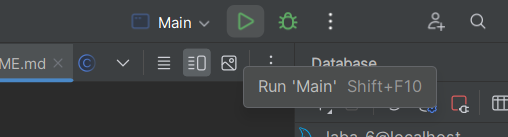

# Changes added in the last update:
### 1 - Added logging into console and file.
### 2 - Added Lombok to clean up boilerplate code.
### 3 - Added Jackson library to conveniently retrieve data in JSON format.

# Instructions os STARTING, USING AND TESTING application:
### 1 - To start application press button RUN

### 2 - To use application properly follow the steps that program tells you:
1. Choose the action you would like to do
2. Choose some additional options if needed
3. Enjoy the result

### 3 - Dont test application
It is not testable